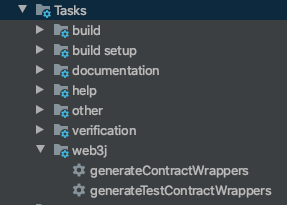

Code Sample and Tutorials
=================

## Using web3j in your project

You can start using web3j in your project by simply adding:

### Maven Java 8 
```
<dependency>
  <groupId>org.web3j</groupId>
  <artifactId>core</artifactId>
  <version>4.6.3</version>
</dependency>
```

### Maven Android

```
<dependency>
  <groupId>org.web3j</groupId>
  <artifactId>core</artifactId>
  <version>4.6.0-android</version>
</dependency>
```

### Gradle Java 8
```
compile ('org.web3j:core:4.6.3')
```

### Gradle Android
```
compile ('org.web3j:core:4.6.0-android')
```

## Connecting to an Ethereum node

To connect to an Ethereum Node you need to create a new `Web3j` instance with an `new HttpService` and the link to you node:
```
Web3j web3 = Web3j.build(new HttpService("https://ropsten.infura.io/your-token"));
```

## Generating Java Wrappers for Solidity Contracts

To generate Java Wrappers for Solidity Contracts you need to add the `Web3j Gradle Plugin` to Gradle
```
plugins {
     id "org.web3j" version "4.6.0"
}
```

Once the plugin is downloaded you should see a new set of tasks under the web3j label:



The simplest way is to create a new folder called solidity in `src/main/solidity` and place your smart contracts there.
To generate the Java wrappers simply run generateContractWrappers or `./gradlew/generateContractWrappers`.
The wrappers will generate under `build/generated/source/web3j/main/java`. 

## Deploying a Smart Contract

To deploy the HelloWorld contract from the previous example:

```java
  Web3j web3j = Web3j.build(new HttpService("https://rinkeby.infura.io/v3/<your_token>"));
  HelloWorld helloWorld = HelloWorld.deploy(web3j, Credentials.create("your_private_key"), new DefaultGasProvider(), "Hello Blockchain World").send();
  String greeting = helloWorld.greeting().send();
  web3j.shutdown();
```

There are many ways to create `Credentials` in web3j, in the above example I decided to use a private key.

You can also use:

- `Credentials.create(ECKeyPair ecKeyPair)`
- `Credentials.create(String privateKey, String publicKey)`

You can also use the `WalletUtils` class to load your credentials from various formats:

- `WalletUtils.loadCredentials(String password,String source)`
- `WalletUtils.loadBip39Credentials(String password,String mnemonic)`
- `WalletUtils.loadBip39Credentials(String password,String mnemonic)`
- `WalletUtils.loadJsonCredentials(String password,String content)`

## Picking GasProviders

The public Interface `ContractGasProvider` has two implementations that can be used in order to pass in a gas provider to the deploy method of the contract.

The `DefaultGasProvider` is pre-defined implementation of the `ContractGasProvider` that has set values for gas price and gas limit.

- `GAS_LIMIT = BigInteger.valueOf(9_000_000);`
- `GAS_PRICE = BigInteger.valueOf(4_100_000_000L));`

If a more flexible approach is required then the `StaticGasProvider` can take custom gas price and gas limit values as BigIntegers.


