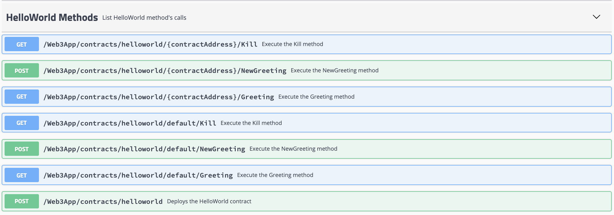
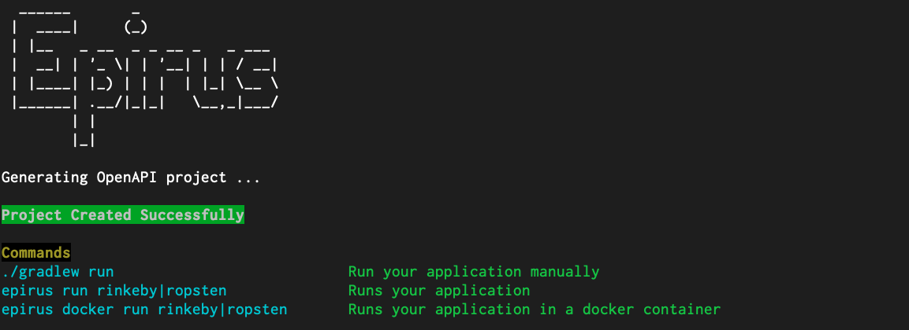
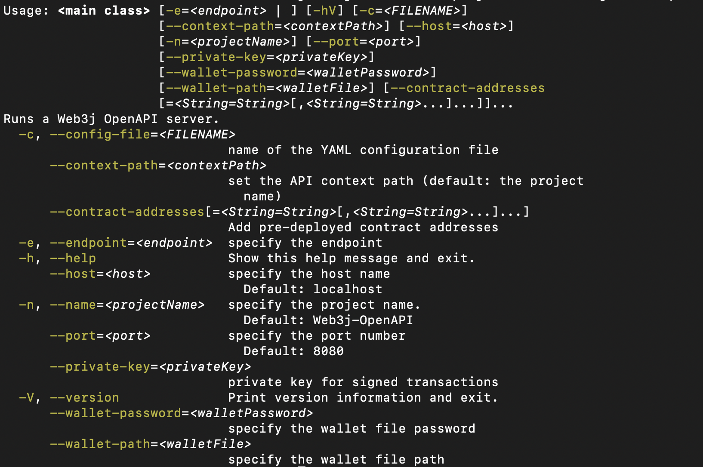
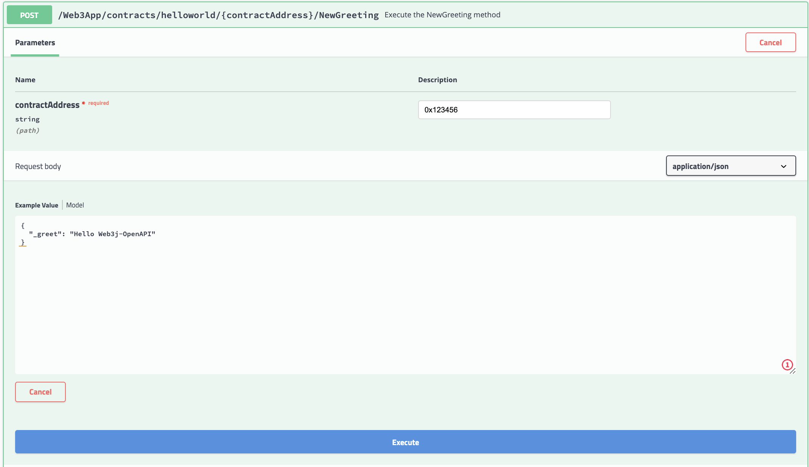

# Web3j-OpenAPI

[Web3j-OpenAPI](https://github.com/web3j/web3j-openapi) is a [OpenAPI](https://swagger.io/specification/)
client and server generator from [Solidity](https://solidity.readthedocs.io/) smart contracts.
It provides a way to interact with the [Ethereum](https://ethereum.org/) smart contracts using a simple RESTful API.
These interactions can be done using plain HTTP requests 
or via the [Swagger-UI](https://swagger.io/tools/swagger-ui/), 
which is generated with every project.

This workflow can be summed in the following steps:
- Writing a Solidity smart contract
- Generating the corresponding [Web3j-OpenAPI](https://github.com/web3j/web3j-openapi) project using [Epirus-CLI](https://docs.epirus.io/quickstart)
- Running the generated project as a standalone server
- Sending HTTP requests using the `Swagger-UI`, `Java/Kotlin` client, `Curl` or other.

## Example
The following Hello World contract :

```
pragma solidity ^0.6.0;

contract HelloWorld {

 event Greeting(string greet);
 
 function hello() public pure returns (string memory) {
   return 'Hello Web3j-OpenAPI';
 }
 
 function sayIt(string memory greeting) public returns (string memory) {
   emit Greeting(greeting);
   return greeting;
 }
}
```

generates the following `OpenAPI` specs : 

```
{
  "openapi": "3.0.1",
  "info": {
    "title": "Web3j OpenApi",
    "contact": {
      "name": "Web3 Labs",
      "url": "http://web3labs.com",
      "email": "hi@web3labs.com"
    },
    "version": "0.0.3.1"
  },
  "tags": [
    {
      "name": "default",
      "description": "Lists existing contracts and events"
    },
    {
      "name": "HelloWorld Methods",
      "description": "List HelloWorld method&#39;s calls"
    },
    {
      "name": "HelloWorld Events",
      "description": "List HelloWorld event&#39;s calls"
    }
  ],
  "paths": {
    "/SimpleJavaProject/contracts/helloworld/{contractAddress}/Hello": {
      "get": {
        "tags": [
          "HelloWorld Methods"
        ],
        "summary": "Execute the Hello method",
        "operationId": "hello",
        "parameters": [
          {
            "name": "contractAddress",
            "in": "path",
            "required": true,
            "schema": {
              "type": "string"
            }
          }
        ],
        "responses": {
          "default": {
            "description": "default response",
            "content": {
              "application/json": {
                "schema": {
                  "$ref": "#/components/schemas/ResultModelString"
                }
              }
            }
          }
        }
      }
    },
...
```

With a corresponding `Swagger-UI` : 


The available methods are:



The available events are:


# Getting started with Web3j-OpenAPI

## Generate a project:
To generate an OpenAPI project using the [Web3j-OpenAPI](https://github.com/web3j/web3j-openapi) generator, you need to have the [Epirus-CLI](https://docs.epirus.io/quickstart) installed on your machine (Note - the Epirus CLI has replaced the Web3j CLI). 
It’s easy to do (for Windows instructions head [here](https://docs.epirus.io/quickstart/#installation)):
	
```
$ curl -L get.epirus.io | sh
```

Then, you can run the
```
$ epirus openapi import --help
```
To check the generator available options. 


In this case, we will be using the above Hello World contract.

Put that contract in a file named `HelloWorld.sol` for starters.

Then, execute the following command: 
```	
$ epirus openapi import  \
    -s HelloWorld.sol \
    --package-name com.tutorial \
    --name HelloWorldProject \
    --output . 
```
You should be seeing logs similar to the following:


## Configure the project

You can run the project easily, without specify any configuration, using the [Epirus-cli](https://docs.epirus.io/quickstart/#deployment).

If not, you need to specify runtime parameters. for example, the `private key` or `wallet file` for the signing,
the `node endpoint` to connect to, etc.

To see the available options, try to run the `distributions` or the `JAR` with the `--help` flag. You'll get the following display:



To specify these parameters, you can set the following environment variables:

```shell script
$ export WEB3J_ENDPOINT=<link to your Ethereum node>
$ export WEB3J_PRIVATE_KEY=<your private key>
$ export WEB3J_OPENAPI_HOST=localhost
$ export WEB3J_OPENAPI_PORT=9090
```

For more information, check the configuration section below.

## Run the project
We can run the project directly : 
```
$ ./gradlew run
```

You should be able to run the server and see the following:


## Interact with the generated project:
Interactions can be done using HTTP requests either through `Curl`:
```ssh
$ curl -X POST "http://{host}:{port}/{application name}/contracts/helloworld/{contractAddress}/SayIt" -H  "accept: application/json" -H  "Content-Type: application/json" -d "{\"greeting\":\"Hello OpenAPI\"}"
```
Or, the `SwaggerUI`, on the link `{host}:{port}/swagger-ui`:



To interact via Java/Kotlin:

```groovy
dependencies {
    implementation "web3j-openapi:web3j-openapi-client:4.6.4"
}
```

Then, within a client application:

```
val service = ClientService("http://localhost:9090")
val helloWorld = ClientFactory.create(HelloWorldProjectApi::class.java, service)

println("Deploying the HelloWorld contract...")

val receipt = helloWorld.contracts.helloWorld.deploy()

println("Deployment receipt: ${receipt.contractAddress}")

val sayItHash = helloWorld.contracts
		.helloWorld
		.load(receipt.contractAddress)
		.sayIt(SayItParameters("Hello Web3j-OpenAPI"))
.transactionHash

println("SayIt method execution transaction hash: $sayItHash")

val hello = helloWorld.contracts
		.helloWorld
		.load(receipt.contractAddress)
		.hello()
		.result

println("Hello method result: $hello")

```

# Ways to generate an OpenAPI project

First, you need to install the [Epirus-CLI](https://docs.epirus.io/quickstart) on your 
machine (Note - the Epirus CLI has replaced the Web3j CLI). 

It’s easy to do (for Windows instructions head [here](https://docs.epirus.io/quickstart/#installation)):
                               	
```
$ curl -L get.epirus.io | sh
```

## Generate a hello world project

A Hello World project is a simple project based on a simple Solidity contract.
It is generated using:
```
$ epirus openapi new
```

This project can be used as a minimal project to start building your custom application
upon.

## Generate using custom Solidity smart contracts

To generate a project using your desired smart contracts, use the following command:

```
$ epirus openapi import \
    --solidity-path <path_to_Solidity_contracts> \
    --project-name <project name> \
    --package-name <package name>
```

## Generate an executable JAR
The following command will generate an executable JAR ready to be run: 
```ssh
$ epirus openapi jar \
    --abi <list to your abi files> \
    --bin <list to your abi files>
```

Where the ABIs and BINs are compiled Solidity code.
You can do that, for example, using [SVM](https://blog.web3labs.com/a-solidity-version-manager-using-sokt).
This lets you handle multiple Solidity compiler versions easily:

```
$ svm install 0.6.0
$ svm use 0.6.0
$ solc --abi --bin -o . HelloWorld.sol
```

## Generate the REST API only

To generate only the API, which is the defined endpoints with their implementations,
use the following:

```
$ epirus openapi generate \
    --abi <list to your abi files> \
    --bin <list to your binary files> \
    --project-name <project name> \
    --package-name <package name>
```

This command will not generate the gradle build files. Thus, you will not have a
runnable application. To have one, check the above sections.


## Generate using the [web3j-openapi-gradle-plugin](https://github.com/web3j/web3j-openapi-gradle-plugin)

# Run the project

## Runtime parameters

Before running the server, there are some parameters that need to
be set. There are multiple ways of doing so:

- Environment variables
- Configuration file
- Passing the parameters directly to the JAR or the executable.

Also, you can run the project without worrying about any of this
using the [Epirus-cli](https://docs.epirus.io/quickstart/#deployment)

### Supported parameters

|  Name                   | Default value                       | Description |
|-------------------------|:-----------------------------------:|-------------|
| `name`                  | `Generation project name`           | The project name |         
| `config file`           | `~/.epirus/web3j.openapi.<extension>`| A custom configuration file to import extra parameters |     
| `endpoint`              | `none`                              | Ethereum node endpoint to target when interacting with the blockchain |
| `privateKey`            | `none`                              | User private key in hex format prefixed by `0x` |
| `wallet path`           | `none`                              | The path to the wallet file (can be absolute or relative) |
| `wallet password`       | `none`                              | The password of the specified wallet file in plain text |
| `host`                  | `localhost`                         | The server host (can be an IP address or a hostname) |
| `port`                  | `8080`                              | The server port |
| `contract addresses`    | `none`                              | Use pre-deployed contract addresses: `contract1=0x123,contract2=0x1234`. All you need to provide to the generator is the ABIs. |

The necessary parameters are:

- The Ethereum node endpoint to target when 
interacting with the Ethereum network `endpoint`.

- Credentials : which can be either `privateKey`, or `wallet path` and `wallet password`

The remaining options are optional.

#### the order of precedence

The parameters can be specified interchangeably between different sources.
ie, you can have some defined in a default configuration file and others in environment
variables etc.

However, for duplicated values, we enforce the following order :

1. CLI arguments
2. Custom configuration file specified in the CLI
3. Custom configuration file specified in Environment variables
4. Default configuration file 
5. Environment variables

Check the following sections for more information.

#### CLI arguments

The CLI arguments can be passed to the command the usual way.

##### Example

Check the Starting the server section below to choose a command.

```shell script
$ <command> \
    --private-key 0x1234 \
    --name OpenApiProject \
    --endpoint <Ethereum node endpoint> \
    --host localhost \
    --port 9090 \
    --contract-addresses contract1=0x1234,contract2=0x123
```

#### Configuration file

You can put the parameters in a **configuration file**. This latter, can be 
`YAML`, `Json` or `Java properties` type of files.

The configuration file can be :

- Put in the default directory : `~/.epirus/web3j.openapi.<extension>`
- Set in an environment variable: `WEB3J_OPENAPI_CONFIG_FILE` where the value is the path
to the file.
eg.
```
export WEB3J_OPENAPI_CONFIG_FILE={the path to the config file}
```
- Set as an argument when running the JAR or the executable: `--config-file`

The supported extensions are :

- `yaml` for a `YAML` configuration. Example:
```yaml
contractAddresses: 
  helloworld: "0x1234"
  helloworld2: "0x1234"
credentials: 
  privateKey: "0x1234"
network: 
  endpoint: "your node endpoint address"
project: 
  name: OpenApiProject
server: 
  host: localhost
  port: 9090
```

- `json` for a `Json` configuration. Example:
```json
{
  "contractAddresses": {
    "helloworld": "0x1234",
    "helloworld2": "0x1234"
  },
  "credentials": {
    "privateKey": "0x1234"
  },
  "network": {
    "endpoint": "your node endpoint address"
  },
  "project": {
    "name": "OpenApiProject"
  },
  "server": {
    "host": "localhost",
    "port": 9090
  }
}
```
- `properties` for a `Java properties` configuration. Example:
```properties
contractAddresses=helloworld=0x1234,helloworld2=0x1234
credentials.privateKey=0x1234
network.endpoint=your node endpoint address
project.name=OpenApiProject
server.host=localhost
server.port=9090
```


#### Environment variables

The easiest way to provide the runtime parameters is through environment variables.

The rule is to:
- Replace the `-` with a `_` : `private-key => private_key`
- Upper case the options' names : `private-key => PRIVATE_KEY`

##### Example
```shell script
$ export WEB3J_ENDPOINT=<link to your Ethereum node>
$ export WEB3J_OPENAPI_HOST=localhost
$ export WEB3J_OPENAPI_PORT=9090
$ export WEB3J_OPENAPI_NAME=Web3jOpenAPI
$ export WEB3J_OPENAPI_CONTRACT_ADDRESSES=helloworld=0x1234,helloworld2=0x12345
$ export WEB3J_OEPNAPI_CONFIG_FILE=~/myConfig.yaml
```
And one of the following:

- A raw private key :
```shell script
$ export WEB3J_PRIVATE_KEY=0x1234
```
- A wallet :
```shell script
$ export WEB3J_WALLET_PATH=~/myWallet.json
$ export WEB3J_WALLET_PASSWORD=myStrongPassword
```

## Start the server

Starting the server can be done in the following ways:

### The generated JAR

A `JAR` can be generated using the following command:

`$ ./gradlew shadowJar`

It will be found under the `build/libs` directory.

The generated `JAR` can be run using the following:

`$ java -jar build/libs/ProjectName-all.jar <parameters>`

check the parameters section above for the supported parameters.

### The distribution executable

A server executable can be generated using the following:

`$ ./gradlew installShadowDist <parameters>`

Which can be found in `build/install/AppName-shadow/bin/`

### Using gradle

To run the project using gradle. Make sure to have set some environment variables or configuration
file as specified above.

Then, run the following : 
```
$ ./gradlew run
```

## The Web3j-OpenAPI client
Among the available ways to interact with a Web3j-OpenAPI server, there is the Kotlin client.

It is easy to use.

Start by adding dependency to the client:

```groovy
dependencies {
    implementation "web3j-openapi:web3j-openapi-client:4.6.4"
}
```

Then, within a client application:

```
val service = ClientService("http://localhost:9090")
val app = ClientFactory.create(<AppNameApi>::class.java, service)

// Then you have access to all the API resources
val receipt = app.contracts.contractName.deploy()

println("Deployment receipt: ${receipt.contractAddress}")

// ...

```

### Handling events

In web3j-OpenAPI, we handle events using Server-Sent Events [SSE](https://docs.huihoo.com/jersey/2.13/sse.html).

In a nutshell, SSE is a one way mechanism that allows a server to asynchronously push data
from the server to the client once the client-server connection is established by the client.

To query events from Kotlin/Java. Add the Web3j-OpenAPI-client dependency as done above.
Then, use the following code:

```kotlin
	val service = ClientService("http://localhost:9090")
	val app = ClientFactory.create(AppNameApi::class.java, service)

    // Start listening for events
	val event = app.contracts.contractName.load(contractAddress)
			.events
			.eventName
			.onEvent { println("Received event: $it") }

    // Trigger an event. The SayIt method emits and event.
	app.contracts
		.contractName
		.load(receipt.contractAddress)
		.sayIt(SayItParameters("Hello Web3j-OpenAPI Events"))
```

Then run this code. You should be able to see events printing on the screen.

